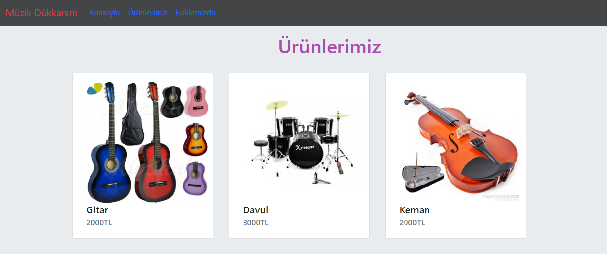

# Kodluyoruz Frontend Eğitimi
-----------------------------------------------------------------------------------------------
This repository created Front-End Education with [Kodluyoruz](https://www.kodluyoruz.org/) & [Patika.dev](https://www.patika.dev/tr).

Includes homework and exercises with Kodluyoruz and Patika.dev.

For Example: 



## Installation

First, clone the project.(Your repository link)

`git clone https://github.com/nurayklc/kodluyoruz-frontend-egitimi.git`

## Usage

After cloning the project, open it in Visual Studio Code.

For Linux:
 
```
cd kodluyoruz-frontend-egitimi
code .
```

## Html and Css Recipe Project

This recipe project is includes specific a recipe.

- Click for Live [Recipe](https://nurayklc.github.io/kodluyoruz-frontend-egitimi/kodluyoruz-html/kodluyoruz-html-odev3/cook.html) 


## Javascript Clock Project

This clock project is show real time clock.

- Click for [Clock Project File](https://github.com/nurayklc/kodluyoruz-frontend-egitimi/tree/main/kodluyoruz-js/clock-work-js)

- Click for Live [Javascript Clock Project](https://nurayklc.github.io/kodluyoruz-frontend-egitimi/kodluyoruz-js/clock-work-js/index.html)

## Contributing

Pull requests are accepted. For major changes, please open a thread to discuss what you want to change first.

## License

[MIT](https://choosealicense.com/licenses/mit/)
